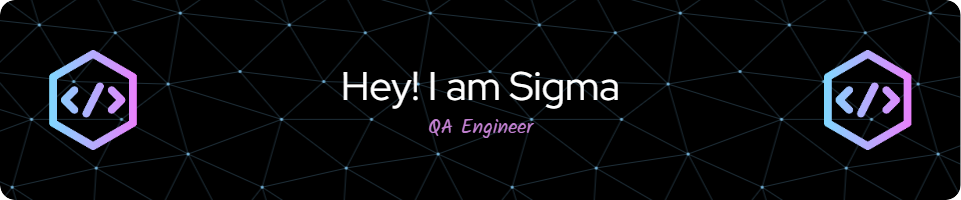

[](mailto:greenfreez@gmail.com) [](https://www.github.com/greengreene/) 
<p align=left>     <a href="https://github.com/greengreene?tab=followers">
    

 ###  About me...  

```ruby
1. I'm a passionate developer using GitHub 
2. to showcase my projects, collaborate with others, and 
3. contribute to open-source communities. 
4. Follow along to see my latest work 
5. and join me in building innovative solutions!
}
```
<p align='left'></p>

 <em><b>I love connecting with different people</b> so if you want to say <b>hi, I'll be happy to get in touch!</b> :)</em>

## Some of my Github Stats

**Social Media:**

[](https://github.com/greengreene)
[](https://www.linkedin.com/in/ziyoda/)
[](https://www.instagram.com/sigmafemaleme?igsh=bW1tYjRzMGFvYmZm)
<a href="https://discord.com/channels/1191968330895085618/1191968330895085620">
    </a>

 
<h3>When I code, I rely on</h3>
<p>
  
  
  
  
  
  
  
 </p>

 <h3>My most recent articles</h3>
<ul>
  <li><a href="https://www.w3schools.com/java/java_variables_reallife.asp"><i>Getting Started with JAVA: A Beginner’s Guide To Gain Base Knowledge in JAVA</i></a></li>
  <li><a href="https://stackoverflow.co/"><i>Developing Work Progress With Teamwork</i></a></li>
  <li><a href="https://codingbat.com/java?message=Account+created"><i>The Ultimate Practice in JAVA</i></a></li>
</ul>

<p>If you think I deserve a little pick-me-up, why not treat me to a cup of coffee/tea? 🥺</p>
<a href="https://buymeacoffee.com/sigmafemale" target="_blank"></a>

<h3>My GitHub contributions summary</h3>

[](https://git.io/streak-stats) 


[](https://github.com/greengreene/github-readme-stats)

export default async function({login, q}, {data, rest, graphql, queries, account}, {pending, imports}) {
  //Check arguments
  const {repo} = q
  if (!repo) {
    console.debug(`metrics/compute/${login}/${repo} > error, repo was undefined`)
    data.errors.push({error: {message: 'You must pass a "repo" argument to use this template'}})
    return imports.plugins.core(...arguments)
  }
  console.debug(`metrics/compute/${login}/${repo} > switching to mode ${account}`)

  //Retrieving single repository
  console.debug(`metrics/compute/${login}/${repo} > retrieving single repository ${repo}`)
  const {[account === "bypass" ? "user" : account]: {repository}} = await graphql(queries.base.repository({login, repo, account}))
  data.user.repositories.nodes = [repository]
  data.user.repositoriesContributedTo.nodes = []
  data.repo = repository

  //Contributors and sponsors
  data.repo.contributors = {totalCount: (await rest.repos.listContributors({owner: data.repo.owner.login, repo})).data.length}
  data.repo.sponsorshipsAsMaintainer = data.user.sponsorshipsAsMaintainer

  //Get commit activity
  console.debug(`metrics/compute/${login}/${repo} > querying api for commits`)
  const commits = []
  for (let page = 1; page < 100; page++) {
    console.debug(`metrics/compute/${login}/${repo} > loading page ${page}`)
    try {
      const {data} = await rest.repos.listCommits({owner: login, repo, per_page: 100, page})
      if (!data.length) {
        console.debug(`metrics/compute/${login}/${repo} > no more page to load`)
        break
      }
      commits.push(...data)
    }
    catch (error) {
      if (/Git Repository is empty/.test(error))
        break
      throw error
    }
  }
  console.debug(`metrics/compute/${login}/${repo} > ${commits.length} commits loaded`)

  //Override creation date, disk usage and website url
  data.user.createdAt = repository.createdAt
  data.user.repositories.totalDiskUsage = repository.diskUsage
  data.user.websiteUrl = repository.homepageUrl

  //Override contributions calendar
  const days = 14
  //Compute relative date for each contribution
  const now = new Date()
  now.setHours(0, 0, 0, 0)
  const contributions = commits.map(({commit}) => Math.abs(Math.ceil((now - new Date(commit.committer.date)) / (24 * 60 * 60 * 1000))))
  //Count contributions per relative day
  const calendar = new Array(days).fill(0)
  for (const day of contributions)
    calendar[day]++
  calendar.splice(days)
  const max = Math.max(...calendar)
  //Override contributions calendar
  data.user.calendar.contributionCalendar.weeks = calendar.map(commit => ({contributionDays: {color: commit ? `var(--color-calendar-graph-day-L${Math.ceil(commit / max / 0.25)}-bg)` : "var(--color-calendar-graph-day-bg)"}}))

  //Override plugins parameters
  q["projects.limit"] = 0

  //Fetching users count if it's an action
  try {
    if (await rest.repos.getContent({owner: login, repo, path: "action.yml"})) {
      console.debug(`metrics/compute/${login}/${repo} > this repository seems to be a GitHub action, fetching users using code search`)
      const {data: {total_count}} = await rest.search.code({q: `uses ${login} ${repo} path:.github/workflows language:YAML`})
      data.repo.actionUsersCount = total_count
    }
  }
  catch {
    //Ignore errors
  }

  //Core
  await imports.plugins.core(...arguments)
  await Promise.all(pending)

  //Set repository name
  data.user.name = `${data.user.login}/${repo}`

  //Reformat projects names
  if (data.plugins.projects)
    data.plugins.projects.list?.map(project => project.name = project.name.replace(`(${login}/${repo})`, "").trim())
}

